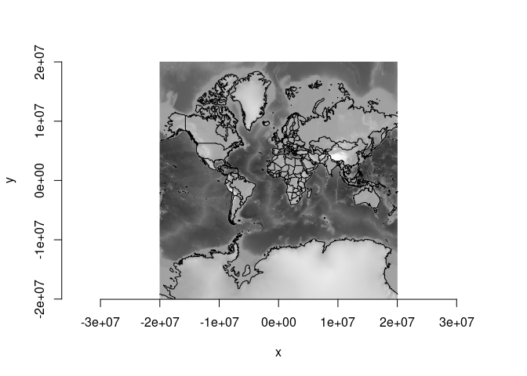

<!-- README.md is generated from README.Rmd. Please edit that file -->

# filearchy

<!-- badges: start -->

[](https://github.com/hypertidy/filearchy/actions/workflows/R-CMD-check.yaml)
<!-- badges: end -->

The goal of filearchy is to generate pyramid tiled image directories.
(Like gdal2tiles.py).

## TODO

- we have `dry_run` in gdal_tiles() but I think it should be a separate
  function to render from the scheme
- (*somehow*) detect the case when warp is not needed (3857-\>3857 or
  4326-\>4326) and use RasterIO (translate) instead, it should be a bit
  faster - but how to encode that in the scheme vs. the run?
- what is profile ‘raster’? just tile in the input_srs?  
- implement xyz vs tms mode (I think it’s just nrow - row)
- driver and file extension options
- make it clear that byte-scaling is not mandatory, perfectly valid to
  have tiles of data like
  [tiles-prod](https://registry.opendata.aws/terrain-tiles/) and see
  [sds::wms_amazon_elevation()](https://hypertidy.github.io/sds/)
- add palette-handling example (or point to one, probably a gdalraster
  vignette on byte-scaling and attach palette and expand)
- add arbitrary zoom levels not just a max
- add resampling option
- add s_srs (but what about general non-georeferenced? why do we have
  s_srs?)
- discuss parallel write, how to enable
- exclude transparent tiles (not sure how, do we detect zero-png/jpg?)
- resume (don’t rewrite non-missing)
- profile mercator/geodetic/raster (not sure what raster is?)

## Installation

You can install the development version of filearchy from
[GitHub](https://github.com/) with:

``` r
# install.packages("devtools")
devtools::install_github("hypertidy/filearchy")
```

## Example

‘gebco_ovr5.vrt’ is a pre-prepared version of GEBCO 2023 elevation COG
that has been Byte-scaled and reduced to the zoom overview 5

``` r
library(filearchy)
#options(parallelly.fork.enable = TRUE, future.rng.onMisuse = "ignore")
#library(future); plan(multicore)
dsn <- system.file("extdata/gebco_ovr5.vrt", package = "filearchy", mustWork = TRUE)
tiles <- gdal_tiles(dsn)
#> [1] "tiles in directory: /tmp/Rtmps0OJ1N/file7536b6b41bcbc"
#plan(sequential)
fs::dir_ls(dirname(dirname(dirname(tiles$path[1]))), recurse = TRUE, type = "f")
#> /tmp/Rtmps0OJ1N/file7536b6b41bcbc/0/0/0.png
#> /tmp/Rtmps0OJ1N/file7536b6b41bcbc/1/0/0.png
#> /tmp/Rtmps0OJ1N/file7536b6b41bcbc/1/0/1.png
#> /tmp/Rtmps0OJ1N/file7536b6b41bcbc/1/1/0.png
#> /tmp/Rtmps0OJ1N/file7536b6b41bcbc/1/1/1.png
#> /tmp/Rtmps0OJ1N/file7536b6b41bcbc/2/0/0.png
#> /tmp/Rtmps0OJ1N/file7536b6b41bcbc/2/0/1.png
#> /tmp/Rtmps0OJ1N/file7536b6b41bcbc/2/0/2.png
#> /tmp/Rtmps0OJ1N/file7536b6b41bcbc/2/0/3.png
#> /tmp/Rtmps0OJ1N/file7536b6b41bcbc/2/1/0.png
#> /tmp/Rtmps0OJ1N/file7536b6b41bcbc/2/1/1.png
#> /tmp/Rtmps0OJ1N/file7536b6b41bcbc/2/1/2.png
#> /tmp/Rtmps0OJ1N/file7536b6b41bcbc/2/1/3.png
#> /tmp/Rtmps0OJ1N/file7536b6b41bcbc/2/2/0.png
#> /tmp/Rtmps0OJ1N/file7536b6b41bcbc/2/2/1.png
#> /tmp/Rtmps0OJ1N/file7536b6b41bcbc/2/2/2.png
#> /tmp/Rtmps0OJ1N/file7536b6b41bcbc/2/2/3.png
#> /tmp/Rtmps0OJ1N/file7536b6b41bcbc/2/3/0.png
#> /tmp/Rtmps0OJ1N/file7536b6b41bcbc/2/3/1.png
#> /tmp/Rtmps0OJ1N/file7536b6b41bcbc/2/3/2.png
#> /tmp/Rtmps0OJ1N/file7536b6b41bcbc/2/3/3.png

gdalraster::createCopy("GTiff", tf <- tempfile(fileext = ".tif"), tiles$path[1])
#> 0...10...20...30...40...50...60...70...80...90...100 - done.

ds <- new(gdalraster::GDALRaster, tf, read_only = FALSE)
## tiles are 256x256 by default
w <- pi *  6378137

ds$setGeoTransform(c(-w, w * 2 / 256, 0, w, 0, -w * 2 / 256))
#> [1] TRUE
gdalraster::plot_raster(ds, bands = 1:3)
#> Warning in graphics::plot.window(xlim = xlim, ylim = ylim, asp = asp, xaxs =
#> xaxs, : "bands" is not a graphical parameter
ds$close()
m <- do.call(cbind, maps::map(plot = F)[1:2])
m[m[,1] > 180, ] <- NA
# library(gdalraster)
## we have to handle missing values 
nas <- is.na(m[,1])
xylines <- m
library(gdalraster)
#> GDAL 3.9.0dev-cb4d30f56d, released 2024/04/15 (debug build), GEOS 3.12.1, PROJ 9.3.1
xylines[!nas, ] <- gdalraster::transform_xy(m[!nas, ], 
             srs_to = srs_to_wkt("EPSG:3857"), srs_from = srs_to_wkt("EPSG:4326"))
lines(xylines)
```



``` r

all(file.exists(tiles$path))
#> [1] TRUE
```

Or, just do a dry_run:

``` r
scheme <- gdal_tiles(dsn, dry_run = TRUE, nzoom = 5)
ex <- c(min(scheme$xmin), max(scheme$xmax), min(scheme$ymin), max(scheme$ymax))
plot(ex[1:2], ex[3:4], asp = 1)

md <- dplyr::filter(scheme, zoom == round(mean(unique(zoom)) ))
with(md, rect(xmin, ymin, xmax, ymax, border = "red", lwd = 3))

mx <- dplyr::filter(scheme, zoom == max(zoom) )
with(mx, rect(xmin, ymin, xmax, ymax))
```


``` r

any(file.exists(scheme$path))
#> [1] FALSE
```

## Code of Conduct

Please note that the filearchy project is released with a [Contributor
Code of
Conduct](https://contributor-covenant.org/version/2/1/CODE_OF_CONDUCT.html).
By contributing to this project, you agree to abide by its terms.
