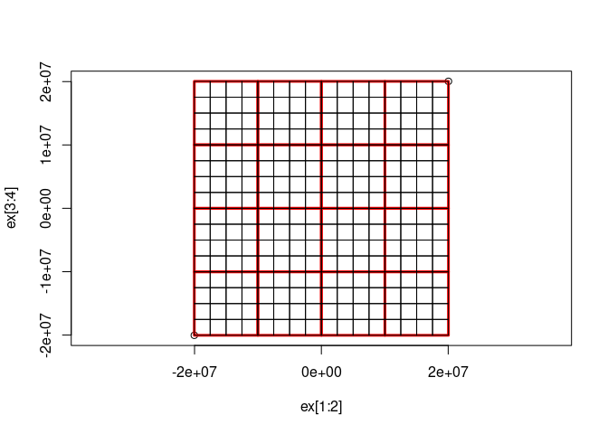

<!-- README.md is generated from README.Rmd. Please edit that file -->

# filearchy

<!-- badges: start -->

[](https://github.com/hypertidy/filearchy/actions/workflows/R-CMD-check.yaml)
<!-- badges: end -->

The goal of filearchy is to generate pyramid tiled image directories.
Like [gdal2tiles.py](https://gdal.org/programs/gdal2tiles.html).

## TODO

- (*somehow*) detect the case when warp is not needed (3857-\>3857 or
  4326-\>4326) and use RasterIO (translate) instead, it should be a bit
  faster - but how to encode that in the scheme vs. the run?

- driver and file extension options, we have png and jpeg

- make it clear that byte-scaling is not mandatory, perfectly valid to
  have tiles of data like
  [tiles-prod](https://registry.opendata.aws/terrain-tiles/) and see
  [sds::wms_amazon_elevation()](https://hypertidy.github.io/sds/)

- add palette-handling example (or point to one, probably a gdalraster
  vignette on byte-scaling and attach palette and expand)

- VRT creation for tiles (at zoom), or conversion to GTI etc

- add resampling option

- discuss parallel write, how to enable

- exclude transparent tiles (not sure how, do we detect zero-png/jpg?)

- DONE add arbitrary zoom levels not just a max

- DONE ‘update’ arg - resume (don’t rewrite non-missing)

- DONE profile mercator/geodetic/raster

- DONE - see `grout::tile_spec()` we have `dry_run` in gdal_tiles() but
  I think it should be a separate function to render from the scheme

- DONE implement xyz vs tms mode

- DONE generate leaflet.html index

## Installation

You can install the development version of filearchy from
[GitHub](https://github.com/) with:

``` r
# install.packages("devtools")
devtools::install_github("hypertidy/filearchy")
```

## Example

‘gebco_ovr5.vrt’ is a pre-prepared version of GEBCO 2023 elevation COG
that has been Byte-scaled and reduced to a manageable subset.

Here we use that as input, it will read data from the internet (a COG of
GEBCO), and write tiles from zoom level 0 to zoom level 3, detected as
the scope of resolution that includes the highest level of detail
available.

We can specify `zoom` to only generate one or more levels, and the
`output_dir` param can be used to specify where the tiles are written.
By default we also get an html index.

``` r
library(filearchy)
#options(parallelly.fork.enable = TRUE, future.rng.onMisuse = "ignore")
#library(future); plan(multicore)
dsn <- system.file("extdata/gebco_ovr5.vrt", package = "filearchy", mustWork = TRUE)

tiles <- gdal_tiles(dsn, dry_run  = FALSE)
#> [1] "tiles in directory: /tmp/RtmpO4tJtl/fileac3c2798d6cdb"

#plan(sequential)
fs::dir_ls(dirname(dirname(dirname(tiles$path[1]))), recurse = TRUE, type = "f")
#> /tmp/RtmpO4tJtl/fileac3c2798d6cdb/0/0/0.png
#> /tmp/RtmpO4tJtl/fileac3c2798d6cdb/1/0/0.png
#> /tmp/RtmpO4tJtl/fileac3c2798d6cdb/1/0/1.png
#> /tmp/RtmpO4tJtl/fileac3c2798d6cdb/1/1/0.png
#> /tmp/RtmpO4tJtl/fileac3c2798d6cdb/1/1/1.png
#> /tmp/RtmpO4tJtl/fileac3c2798d6cdb/2/0/0.png
#> /tmp/RtmpO4tJtl/fileac3c2798d6cdb/2/0/1.png
#> /tmp/RtmpO4tJtl/fileac3c2798d6cdb/2/0/2.png
#> /tmp/RtmpO4tJtl/fileac3c2798d6cdb/2/0/3.png
#> /tmp/RtmpO4tJtl/fileac3c2798d6cdb/2/1/0.png
#> /tmp/RtmpO4tJtl/fileac3c2798d6cdb/2/1/1.png
#> /tmp/RtmpO4tJtl/fileac3c2798d6cdb/2/1/2.png
#> /tmp/RtmpO4tJtl/fileac3c2798d6cdb/2/1/3.png
#> /tmp/RtmpO4tJtl/fileac3c2798d6cdb/2/2/0.png
#> /tmp/RtmpO4tJtl/fileac3c2798d6cdb/2/2/1.png
#> /tmp/RtmpO4tJtl/fileac3c2798d6cdb/2/2/2.png
#> /tmp/RtmpO4tJtl/fileac3c2798d6cdb/2/2/3.png
#> /tmp/RtmpO4tJtl/fileac3c2798d6cdb/2/3/0.png
#> /tmp/RtmpO4tJtl/fileac3c2798d6cdb/2/3/1.png
#> /tmp/RtmpO4tJtl/fileac3c2798d6cdb/2/3/2.png
#> /tmp/RtmpO4tJtl/fileac3c2798d6cdb/2/3/3.png
#> /tmp/RtmpO4tJtl/fileac3c2798d6cdb/3/0/0.png
#> /tmp/RtmpO4tJtl/fileac3c2798d6cdb/3/0/1.png
#> /tmp/RtmpO4tJtl/fileac3c2798d6cdb/3/0/2.png
#> /tmp/RtmpO4tJtl/fileac3c2798d6cdb/3/0/3.png
#> /tmp/RtmpO4tJtl/fileac3c2798d6cdb/3/0/4.png
#> /tmp/RtmpO4tJtl/fileac3c2798d6cdb/3/0/5.png
#> /tmp/RtmpO4tJtl/fileac3c2798d6cdb/3/0/6.png
#> /tmp/RtmpO4tJtl/fileac3c2798d6cdb/3/0/7.png
#> /tmp/RtmpO4tJtl/fileac3c2798d6cdb/3/1/0.png
#> /tmp/RtmpO4tJtl/fileac3c2798d6cdb/3/1/1.png
#> /tmp/RtmpO4tJtl/fileac3c2798d6cdb/3/1/2.png
#> /tmp/RtmpO4tJtl/fileac3c2798d6cdb/3/1/3.png
#> /tmp/RtmpO4tJtl/fileac3c2798d6cdb/3/1/4.png
#> /tmp/RtmpO4tJtl/fileac3c2798d6cdb/3/1/5.png
#> /tmp/RtmpO4tJtl/fileac3c2798d6cdb/3/1/6.png
#> /tmp/RtmpO4tJtl/fileac3c2798d6cdb/3/1/7.png
#> /tmp/RtmpO4tJtl/fileac3c2798d6cdb/3/2/0.png
#> /tmp/RtmpO4tJtl/fileac3c2798d6cdb/3/2/1.png
#> /tmp/RtmpO4tJtl/fileac3c2798d6cdb/3/2/2.png
#> /tmp/RtmpO4tJtl/fileac3c2798d6cdb/3/2/3.png
#> /tmp/RtmpO4tJtl/fileac3c2798d6cdb/3/2/4.png
#> /tmp/RtmpO4tJtl/fileac3c2798d6cdb/3/2/5.png
#> /tmp/RtmpO4tJtl/fileac3c2798d6cdb/3/2/6.png
#> /tmp/RtmpO4tJtl/fileac3c2798d6cdb/3/2/7.png
#> /tmp/RtmpO4tJtl/fileac3c2798d6cdb/3/3/0.png
#> /tmp/RtmpO4tJtl/fileac3c2798d6cdb/3/3/1.png
#> /tmp/RtmpO4tJtl/fileac3c2798d6cdb/3/3/2.png
#> /tmp/RtmpO4tJtl/fileac3c2798d6cdb/3/3/3.png
#> /tmp/RtmpO4tJtl/fileac3c2798d6cdb/3/3/4.png
#> /tmp/RtmpO4tJtl/fileac3c2798d6cdb/3/3/5.png
#> /tmp/RtmpO4tJtl/fileac3c2798d6cdb/3/3/6.png
#> /tmp/RtmpO4tJtl/fileac3c2798d6cdb/3/3/7.png
#> /tmp/RtmpO4tJtl/fileac3c2798d6cdb/3/4/0.png
#> /tmp/RtmpO4tJtl/fileac3c2798d6cdb/3/4/1.png
#> /tmp/RtmpO4tJtl/fileac3c2798d6cdb/3/4/2.png
#> /tmp/RtmpO4tJtl/fileac3c2798d6cdb/3/4/3.png
#> /tmp/RtmpO4tJtl/fileac3c2798d6cdb/3/4/4.png
#> /tmp/RtmpO4tJtl/fileac3c2798d6cdb/3/4/5.png
#> /tmp/RtmpO4tJtl/fileac3c2798d6cdb/3/4/6.png
#> /tmp/RtmpO4tJtl/fileac3c2798d6cdb/3/4/7.png
#> /tmp/RtmpO4tJtl/fileac3c2798d6cdb/3/5/0.png
#> /tmp/RtmpO4tJtl/fileac3c2798d6cdb/3/5/1.png
#> /tmp/RtmpO4tJtl/fileac3c2798d6cdb/3/5/2.png
#> /tmp/RtmpO4tJtl/fileac3c2798d6cdb/3/5/3.png
#> /tmp/RtmpO4tJtl/fileac3c2798d6cdb/3/5/4.png
#> /tmp/RtmpO4tJtl/fileac3c2798d6cdb/3/5/5.png
#> /tmp/RtmpO4tJtl/fileac3c2798d6cdb/3/5/6.png
#> /tmp/RtmpO4tJtl/fileac3c2798d6cdb/3/5/7.png
#> /tmp/RtmpO4tJtl/fileac3c2798d6cdb/3/6/0.png
#> /tmp/RtmpO4tJtl/fileac3c2798d6cdb/3/6/1.png
#> /tmp/RtmpO4tJtl/fileac3c2798d6cdb/3/6/2.png
#> /tmp/RtmpO4tJtl/fileac3c2798d6cdb/3/6/3.png
#> /tmp/RtmpO4tJtl/fileac3c2798d6cdb/3/6/4.png
#> /tmp/RtmpO4tJtl/fileac3c2798d6cdb/3/6/5.png
#> /tmp/RtmpO4tJtl/fileac3c2798d6cdb/3/6/6.png
#> /tmp/RtmpO4tJtl/fileac3c2798d6cdb/3/6/7.png
#> /tmp/RtmpO4tJtl/fileac3c2798d6cdb/3/7/0.png
#> /tmp/RtmpO4tJtl/fileac3c2798d6cdb/3/7/1.png
#> /tmp/RtmpO4tJtl/fileac3c2798d6cdb/3/7/2.png
#> /tmp/RtmpO4tJtl/fileac3c2798d6cdb/3/7/3.png
#> /tmp/RtmpO4tJtl/fileac3c2798d6cdb/3/7/4.png
#> /tmp/RtmpO4tJtl/fileac3c2798d6cdb/3/7/5.png
#> /tmp/RtmpO4tJtl/fileac3c2798d6cdb/3/7/6.png
#> /tmp/RtmpO4tJtl/fileac3c2798d6cdb/3/7/7.png
```

Now open the html index \*\* “leaflet.html” \*\* from that directory.

Or, just do a dry_run:

``` r
(scheme <- gdal_tiles(dsn,  zoom = 0:5))
#> # A tibble: 1,365 × 11
#>     tile tile_col tile_row  zoom       xmin       xmax      ymin      ymax  ncol
#>    <dbl>    <dbl>    <dbl> <int>      <dbl>      <dbl>     <dbl>     <dbl> <dbl>
#>  1     0        0        0     0 -20037508.  20037508. -2.0038e7  2.0038e7   256
#>  2     2        0        0     1 -20037508.         0  -2.0038e7  0          256
#>  3     3        1        0     1         0   20037508. -2.0038e7  0          256
#>  4     0        0        1     1 -20037508.         0   0         2.0038e7   256
#>  5     1        1        1     1         0   20037508.  0         2.0038e7   256
#>  6    12        0        0     2 -20037508. -10018754. -2.0038e7 -1.0019e7   256
#>  7    13        1        0     2 -10018754.         0  -2.0038e7 -1.0019e7   256
#>  8    14        2        0     2         0   10018754. -2.0038e7 -1.0019e7   256
#>  9    15        3        0     2  10018754.  20037508. -2.0038e7 -1.0019e7   256
#> 10     8        0        1     2 -20037508. -10018754. -1.0019e7  0          256
#> # ℹ 1,355 more rows
#> # ℹ 2 more variables: nrow <dbl>, crs <chr>

ex <- c(min(scheme$xmin), max(scheme$xmax), min(scheme$ymin), max(scheme$ymax))
plot(ex[1:2], ex[3:4], asp = 1)

md <- dplyr::filter(scheme, zoom == round(mean(unique(zoom)) ))
with(md, rect(xmin, ymin, xmax, ymax, border = "red", lwd = 3))

mx <- dplyr::filter(scheme, zoom == max(zoom) )
with(mx, rect(xmin, ymin, xmax, ymax))
```



## Code of Conduct

Please note that the filearchy project is released with a [Contributor
Code of
Conduct](https://contributor-covenant.org/version/2/1/CODE_OF_CONDUCT.html).
By contributing to this project, you agree to abide by its terms.
